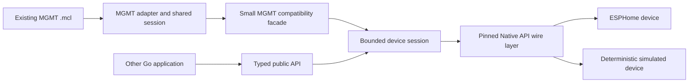

# go-aioesphomeapi

An independent, Go-native client for the [ESPHome Native API](https://developers.esphome.io/architecture/api/protocol_details/), built first to be the safest and smallest library MGMT can use for native ESPHome integration.

> [!IMPORTANT]
> The first usable client slice is implemented on this development branch: secure Noise transport, explicit test-only plaintext, MGMT's current entity surface, Fan and RGB Light commands, and deterministic simulators. A real MGMT process now passes encrypted acceptance for both original unchanged MCL examples and the unchanged conveyor MCL. Real-driver tests also cover MGMT-owned polling, reconnect, and outage accounting without hardware. It is not a tagged release yet. The [support matrix](docs/support-matrix.md) is the authoritative record of evidence and limitations.

## The realigned goal

MGMT's experimental [`feat/esphome`](https://github.com/purpleidea/mgmt/compare/master...flavio-fernandes:mgmt:feat/esphome) branch uses [`Richard87/esphome-apiclient`](https://github.com/Richard87/esphome-apiclient). The draft [`feat/esphome2` replacement](https://github.com/flavio-fernandes/mgmt/pull/1) now uses this library, preserves both existing `.mcl` examples byte for byte, and adds Fan, RGB Light, and conveyor-demo support. This project provides that behavior behind a deliberately small compatibility facade, then improves it with secure defaults, bounded concurrency, deterministic device simulation, current protocol tracking, and a conservative dependency budget.

Success means MGMT can replace the client dependency without changing the behavior of its existing `.mcl` examples. The intended migration changes Go import paths and only the smallest reviewed adapter details; it does not rename MCL functions, resources, parameters, or semantics.

This remains an independent greenfield implementation. The reference client is a behavioral baseline, not a code base. The official ESPHome protocol definition remains wire truth.

## Start here

- Copy/paste repository commands: [cheatsheet](CHEATSHEET.md)
- Exact MGMT behavior we must preserve: [MGMT compatibility contract](docs/mgmt-integration.md)
- What is implemented and evidenced: [support matrix](docs/support-matrix.md)
- Why dependencies face a high bar: [dependency policy](docs/dependency-policy.md)
- Controlled delivery sequence: [roadmap](docs/roadmap.md)
- Exact Milestone 1 build order: [implementation sequence](docs/m1-implementation-plan.md)
- How the reference implementations compare: [baseline audit](docs/reference-baseline.md)

Documentation is part of the product. Runnable commands must be tested, safe by default, and explicit about prerequisites. The [documentation contract](docs/documentation-style.md) applies to every feature.

## Design promises

- Existing MGMT `.mcl` behavior is a release-blocking compatibility contract.
- Core types remain generic ESPHome concepts; MGMT and conveyor types stay outside the library.
- Noise is required by the normal production path. Plaintext requires an unmistakable insecure opt-in.
- One concurrency-safe connection per client has bounded queues and no silent command replay. The caller owns reconnect policy.
- A deterministic simulated device exercises the real framing and session path without hardware.
- The standard library is preferred. Every runtime dependency needs an ADR and evidence; convenience dependencies do not enter the core.
- Generated protobuf compatibility and the stable handwritten API are clearly separated.
- No credentials, private network data, real device identifiers, camera media, or personal contact data belong in the repository.

## Intended shape

The conveyor demonstration is the first visible acceptance system, not the library architecture. See the [architecture](docs/architecture.md) and [conveyor profile](docs/conveyor-demo.md).

## Repository status

The repository is public and GPL-3.0-only licensed. The original immutable MGMT baseline is recorded in [`compatibility/mgmt-feat-esphome.json`](compatibility/mgmt-feat-esphome.json), the replacement candidate is recorded in [`compatibility/mgmt-feat-esphome2.json`](compatibility/mgmt-feat-esphome2.json), and append-only runtime proofs cover the [conveyor](compatibility/mgmt-feat-esphome2-runtime.json) and [both original baseline examples plus polling/reconnect](compatibility/mgmt-feat-esphome2-baselines.json). The ESPHome 2026.7.0 wire surface is recorded in [`protocol/upstream.lock.json`](protocol/upstream.lock.json). Run the no-hardware quickstart in the [cheatsheet](CHEATSHEET.md).

## License

Original work is licensed under the [GNU General Public License v3.0 only](LICENSE). Imported or generated protocol material must satisfy [provenance](docs/provenance.md) and [third-party notice](THIRD_PARTY_NOTICES.md) requirements before merge.
