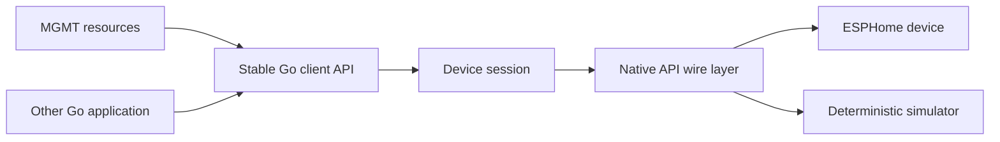

# go-aioesphomeapi

An independent, Go-native client library for the [ESPHome Native API](https://developers.esphome.io/architecture/api/protocol_details/), designed first for reliable use by [MGMT](https://github.com/purpleidea/mgmt).

> [!IMPORTANT]
> This repository is in architecture and protocol-research phase. It does not yet contain a usable client. The [support matrix](docs/support-matrix.md) is the authoritative statement of implemented and verified behavior.

The long-term aspiration is to offer Go users the kind of complete, current Native API client experience that [`esphome/aioesphomeapi`](https://github.com/esphome/aioesphomeapi) offers Python users. This project is unofficial, is not affiliated with or endorsed by ESPHome, and will earn compatibility through tests rather than name similarity.

## Start here

- Want copy/paste commands? Open the friendly [cheatsheet](CHEATSHEET.md).
- Want to know what really works? Check the [support matrix](docs/support-matrix.md).
- Want to help? Read the short [contributing guide](CONTRIBUTING.md).
- Want the long-term sequence? See the [controlled roadmap](docs/roadmap.md).

Documentation is part of the product. Runnable commands must be tested, safe by default, and explicit about prerequisites. The [documentation contract](docs/documentation-style.md) applies to every future feature.

## Design promises

- Generic ESPHome concepts in the core library; no conveyor or MGMT domain types.
- Noise encryption for production connections. Plaintext requires explicit opt-in.
- One concurrency-safe session per device, with bounded resources and observable reconnects.
- Generated wire types kept separate from stable public APIs.
- A deterministic in-process simulated device using the same transport and protocol stack.
- Explicit upstream provenance and a continuously maintained support matrix.
- A simulator-first beginner path and maintained copy/paste commands.
- No credentials, private network data, device identifiers, camera media, or personal contact data in the repository.

## Intended shape

The conveyor demonstration is the first end-to-end acceptance system, not the library architecture. See [the architecture](docs/architecture.md), [MGMT boundary](docs/mgmt-integration.md), and [conveyor acceptance profile](docs/conveyor-demo.md).

## Repository status

This initial private bootstrap contains specifications, governance, security controls, and machine-operable workflows. Implementation begins only after the Gate 0 decisions in the [roadmap](docs/roadmap.md) are accepted.

## License

The repository's original work is planned for release under the [MIT License](LICENSE). Imported or generated protocol material must pass the provenance rules in [THIRD_PARTY_NOTICES.md](THIRD_PARTY_NOTICES.md) before it is committed.
