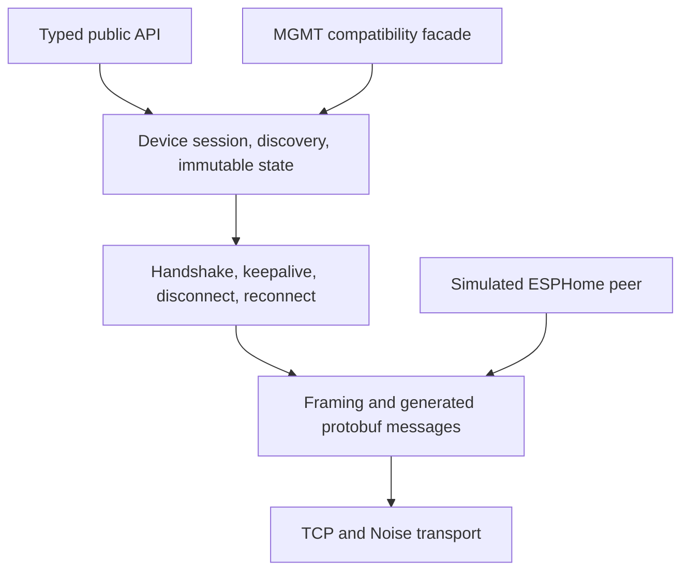

# Architecture

## Scope and priority

`go-aioesphomeapi` is an independent Go implementation of the ESPHome Native API client role. Its first hard consumer contract is the MGMT `feat/esphome` branch. Its core model remains useful without MGMT or a conveyor.

Priority is explicit:

1. preserve the existing MGMT `.mcl` behavior;
2. make the MGMT migration mechanically small and reviewable;
3. improve security, lifecycle correctness, simulation, and dependency cost;
4. expand toward broad current ESPHome support using evidence.

The GPL-3.0-only library imports no MGMT package or MGMT source. Cross-repository tests may check out MGMT at a pinned revision and run it as an external consumer.

## Layer boundaries



1. **Transport** owns context-aware dialing, deadlines, bounded reads and writes, Noise, explicit insecure test transport, and secret-safe errors.
2. **Wire** owns ESPHome framing and reproducibly generated protobuf types.
3. **Lifecycle** owns hello, API version, ping, disconnect, and one connection attempt. Device information is planned.
4. **Client** owns one active connection, discovery, subscriptions, state snapshots, and serialized frame writes. Reconnect state belongs to its caller.
5. **MGMT compatibility facade** exposes only the symbols needed by the pinned MGMT driver with matching behavior. It does not own MGMT pooling or convergence.
6. **Typed public API** provides the preferred generic Go experience without requiring callers to traffic in generated messages.
7. **Simulator** is a server-side peer using the same framing and wire definitions. It is not a fake client.

Dependencies point downward. MGMT, examples, firmware, and workbench tooling never become core dependencies.

## Two public surfaces, one implementation

The current MGMT adapter consumes generated protobuf messages and registry accessors from the reference client. The lowest-risk migration therefore needs a narrow source-compatibility surface at the module root and `pb` package. It includes only symbols listed in the compatibility manifest and is tested by compiling the pinned MGMT adapter with import-path changes.

The handwritten typed API is the preferred long-term surface. Both facades call the same internal session; neither duplicates transport or lifecycle code.

Generated `pb` symbols are public only as a versioned compatibility escape hatch. They follow the pinned upstream protocol and are not covered by the handwritten API's semantic-version stability promise. This exception supersedes the internal-only statement proposed in ADR 0003.

## MGMT ownership boundary

MGMT already owns valuable behavior in its branch: endpoint publication, per-endpoint pooling, persistent and polling modes, reconnect policy, outage tracking, desired-versus-observed comparison, MCL functions/resources, and cleanup. This library must not absorb or fork that logic.

The initial client must provide the driver operations that MGMT expects:

- context-bound secure dial and clean close;
- entity discovery and lookup metadata;
- binary-sensor, sensor, text-sensor, switch, and number states;
- switch, number, and button commands;
- bounded device-log subscription;
- connection completion signaling;
- no internal reconnect when MGMT owns reconnect.

Fan support is also M1 because the conveyor uses ESPHome's generic H-bridge fan model, but existing MCL compatibility does not depend on it.

## Stable API rules

- Every blocking handwritten operation accepts `context.Context`.
- A client/session is safe for concurrent use unless explicitly documented otherwise.
- Callbacks never run on the network read loop or while internal locks are held.
- Every queue is finite and has documented overflow behavior.
- Cancellation closes the relevant network operation and background goroutines.
- Reconnect is observable and never silently replays a non-idempotent command.
- Metadata and states cross the API boundary as immutable snapshots.
- Unknown fields, enum values, and safe-to-ignore messages do not crash the process.
- Unsupported commands fail locally with typed, redacted errors when capability data makes that knowable.
- The compatibility facade may preserve a reference signature, but it may strengthen validation, bounds, cancellation, and error safety when MGMT-observable semantics remain intact.

## Dependency direction and budget

The core target is the Go standard library plus only dependencies that are technically unavoidable and accepted by ADR. Protobuf runtime and one established Noise implementation are the expected candidates. mDNS, CLI frameworks, YAML parsers, telemetry SDKs, assertion libraries, and simulator frameworks are not core runtime dependencies.

Name resolution is supplied by `net` or an injected dialer. Optional discovery, CLI, and integrations live in separate packages or programs and cannot make MGMT pay their dependency cost.

See [dependency policy](dependency-policy.md) for the admission gate.

## Approachability is an architecture constraint

The first successful workflow requires only a supported Go toolchain and the in-process simulator. It does not require ESPHome hardware, a private network, or a credential. Every public feature needs a small runnable example and an entry in `CHEATSHEET.md`.

## Protocol evolution

The wire source of truth is ESPHome's `api.proto` at a pinned commit. A sync updates the lock, source/digest, generated Go types, protocol inventory, and support matrix atomically. Reference clients never become protocol truth.

Forward compatibility strategy:

- negotiate and record API versions;
- tolerate unknown protobuf fields;
- safely ignore unknown message types only where framing permits;
- preserve unknown enum numeric values at the wire boundary;
- gate handwritten behavior by capability and version;
- test the pinned MGMT baseline, oldest supported firmware, current stable ESPHome, and a development snapshot.

## Planned package responsibilities

```text
aioesphomeapi        MGMT-compatible facade plus preferred typed client
pb                   reproducibly generated compatibility wire types
internal/wire        framing, registry, protocol limits
internal/session     lifecycle, routing, keepalive, reconnect
simulator            public deterministic simulated-device API
examples             generic and conveyor acceptance programs
```

Package creation is an implementation decision. A boundary change, new runtime dependency, or compatibility break requires an ADR.
