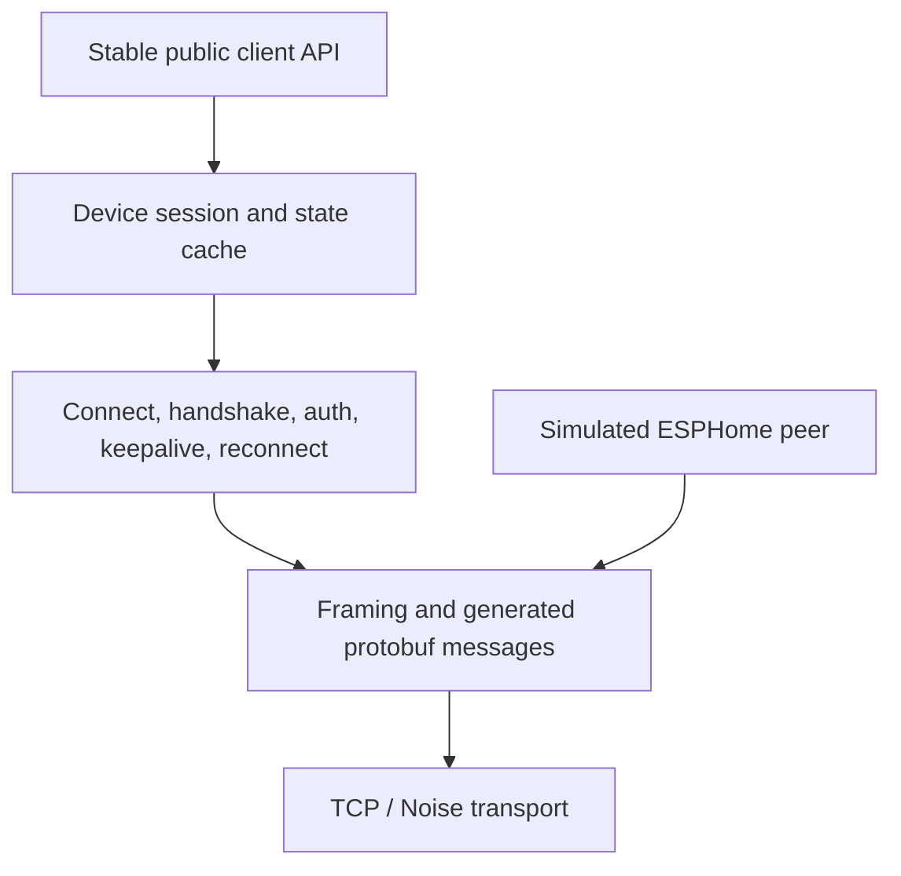

# Architecture

## Scope

`go-aioesphomeapi` is an independent Go implementation of the ESPHome Native API client role. Its public model is ESPHome-generic and must remain useful when no MGMT or conveyor code is present.

The initial customer is MGMT. That priority affects lifecycle, concurrency, observability, cancellation, and Go-version choices; it does not place MGMT types or MGMT source code in this independent repository.

## Layer boundaries



1. **Transport** owns deadlines, bounded reads/writes, encryption, and redaction. Production configuration defaults to Noise.
2. **Wire** owns ESPHome framing and generated protobuf types. Generated symbols are not the stable public API.
3. **Lifecycle** owns hello/connect, authentication, device information, keepalive, disconnect, reconnect policy, and connection state.
4. **Session** owns exactly one connection per device, entity discovery, subscriptions, command serialization, state fan-out, and cache snapshots.
5. **Public API** owns typed, context-aware operations and explicit unsupported-capability results.
6. **Simulator** is a server-side peer that uses the same framing and generated messages as the client. It is not a fake public client.

Dependencies point downward. Examples may depend on the public API; the public API never depends on examples, MGMT, firmware configuration, or workbench tooling.

## Core vocabulary

- Device identity and advertised API version
- Connection and authentication state
- Entity descriptors and entity keys
- State events and subscriptions
- Commands and service calls
- Capabilities and explicit unsupported behavior
- Logs and diagnostics with structured redaction

There are no `Conveyor`, `Belt`, `Station`, or `MotorSafetyPolicy` types in the core. An ESPHome H-bridge fan may happen to drive a conveyor motor, but the library exposes the entity and command semantics advertised by ESPHome.

## Stable API rules

- Every blocking operation accepts `context.Context`.
- A `Client` or `Device` is safe for concurrent use unless documentation says otherwise.
- Callbacks never run while internal protocol locks are held.
- Slow subscribers have explicit bounded-buffer behavior; memory growth is never unbounded.
- Reconnect is observable and does not silently replay unsafe commands.
- Entity metadata and the latest state are immutable snapshots at the API boundary.
- Unknown enum values and future messages do not crash the process.
- Unsupported commands fail locally with a typed error when capability data makes that knowable.

## Approachability is an architecture constraint

The first successful workflow must require only a supported Go toolchain and the in-process simulator. It must not require ESPHome hardware, a private network, or a real credential. Public APIs and errors should make the safe path easy to discover without hiding important lifecycle behavior.

Every public feature needs a small, runnable example and a copy/paste path in `CHEATSHEET.md`. Examples use stable public APIs, not internal packages. Commands, prerequisites, expected results, and common failure remedies follow `docs/documentation-style.md`.

## Protocol evolution

The source of truth is ESPHome's upstream `api.proto` at a pinned commit. A sync updates four things atomically: the vendored definition or digest, generated Go wire types, protocol inventory, and support matrix. Generated presence is recorded as `known`, not `implemented`.

Forward compatibility strategy:

- negotiate and record API versions;
- tolerate unknown protobuf fields;
- safely ignore unknown message types only when the framing rules permit it;
- preserve unknown enum numeric values in wire-level representations;
- gate handwritten behavior by capability and version;
- test the oldest supported firmware and current ESPHome release line.

## Package plan

The package tree is a milestone decision, not an implementation commitment. The intended responsibilities are:

```text
aioesphomeapi        stable public client and types
internal/wire        generated protobuf and framing
internal/session     lifecycle, routing, keepalive, reconnect
simulator            public deterministic simulated-device API
examples             generic and conveyor acceptance programs
```

Adding packages requires an accepted ADR when it changes these boundaries.
