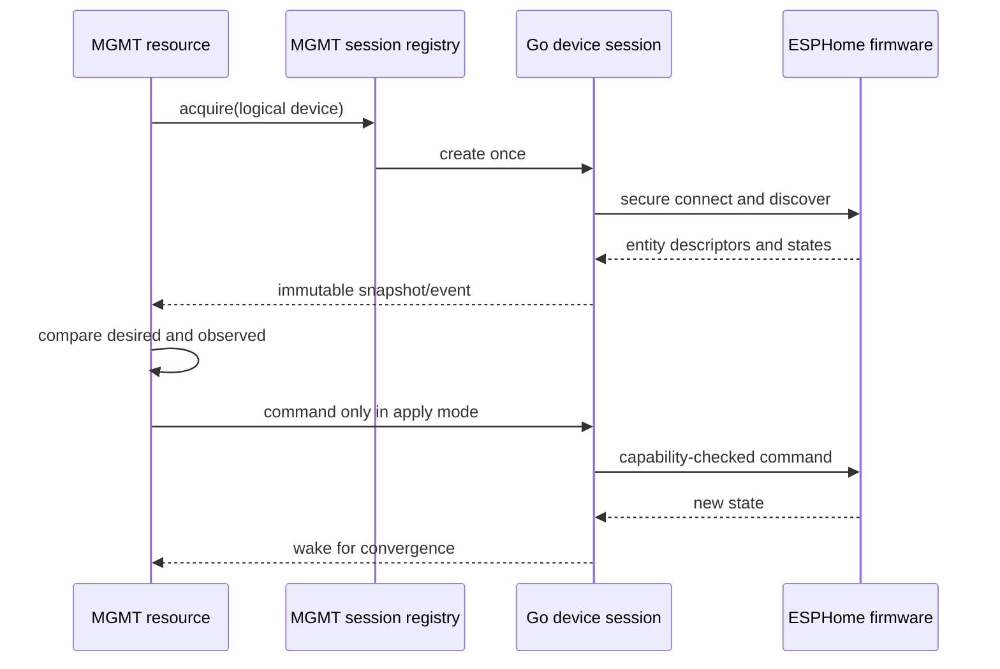

# MGMT integration boundary

MGMT is the first customer and determines the initial operational quality bar. It does not determine the core library vocabulary.

## Ownership

| Concern | Owner |
|---|---|
| Native API bytes, sessions, discovery, state, commands | `go-aioesphomeapi` |
| Generic device connection sharing within a process | `go-aioesphomeapi` plus an MGMT-local registry |
| Desired state, convergence, dependencies, graph ordering | MGMT |
| Mapping MGMT resources to ESPHome entities | MGMT repository |
| Conveyor routing policy | MGMT example/module |
| Motor interlocks and immediate stop behavior | ESPHome firmware and physical hardware |

The library must not import MGMT. MGMT may import this GPL-3.0-only library. Integration code that implements MGMT interfaces belongs under MGMT's GPL-compatible repository and follows MGMT's `Default`, `Validate`, `Init`, `Watch`, `CheckApply`, and `Cleanup` lifecycle.

## Proposed MGMT session pattern

Multiple MGMT resources targeting one device acquire a shared device session from an MGMT-owned registry keyed by a non-secret logical device reference. The first acquisition starts the connection; the final release closes it. Entity resources subscribe through the shared session and wake MGMT when relevant state changes.

`CheckApply` compares desired state with an immutable observed snapshot. It sends a command only when apply is requested and the entity capability permits it. Commands are not silently replayed after a reconnect. `Cleanup` releases subscriptions promptly and cannot leak goroutines.

## Configuration rules

- Secrets come through MGMT's approved secret mechanism, not resource strings rendered into logs.
- A logical enrollment name resolves to address and Noise key outside the resource's printable state.
- Secure transport is implicit; insecure development mode must be verbose and explicit.
- Entity selection prefers stable object keys/IDs over friendly names and detects ambiguity.

## First integration sequence

The registry and MGMT resources will be designed and reviewed in the MGMT repository once the M1 client contract is stable.
